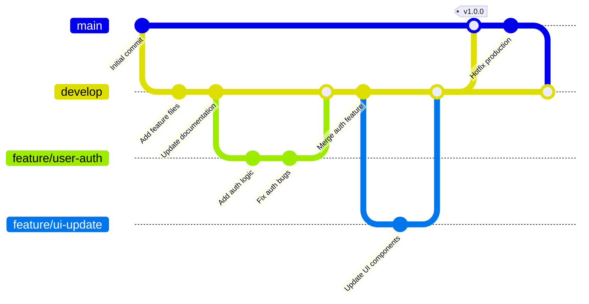

# Git Workflow Diagram

## Git Branching Strategy

This diagram illustrates a common Git workflow:

1. **Main Branch**: Production-ready code
2. **Develop Branch**: Integration branch for features
3. **Feature Branches**: Isolated development work
4. **Merges**: Integrating changes between branches
5. **Tags**: Version releases

The workflow shows how features are developed in isolation, merged to develop for integration, and finally released to production through main branch merges.
