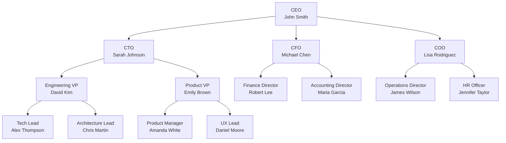

# Organization Chart Example

```mermaid
graph TD
    CEO[CEO<br/>John Smith]
    
    CEO --> CTO[CTO<br/>Sarah Johnson]
    CEO --> CFO[CFO<br/>Michael Chen]
    CEO --> COO[COO<br/>Lisa Rodriguez]
    
    CTO --> EngVP[Engineering VP<br/>David Kim]
    CTO --> ProdVP[Product VP<br/>Emily Brown]
    
    CFO --> FinDir[Finance Director<br/>Robert Lee]
    CFO --> AccDir[Accounting Director<br/>Maria Garcia]
    
    COO --> OpsDir[Operations Director<br/>James Wilson]
    COO --> HROfficer[HR Officer<br/>Jennifer Taylor]
    
    EngVP --> TechLead[Tech Lead<br/>Alex Thompson]
    EngVP --> ArchLead[Architecture Lead<br/>Chris Martin]
    
    ProdVP --> ProdMgr[Product Manager<br/>Amanda White]
    ProdVP --> UXLead[UX Lead<br/>Daniel Moore]
    
```
